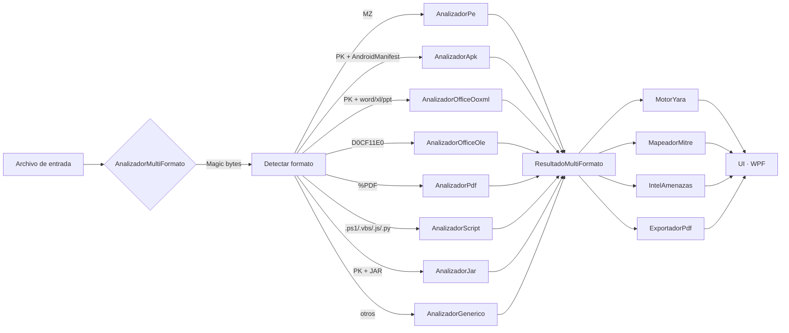

<div align="center">


# Malyzer

### Herramienta de análisis de malware **multi-formato** para Windows

*PE · APK · Office · PDF · Scripts · JAR · ELF · Mach-O · todo desde una sola interfaz*

<br/>

[](https://dotnet.microsoft.com/)
[](https://learn.microsoft.com/dotnet/desktop/wpf/)
[](https://www.microsoft.com/windows/)
[](#-licencia)
[](#-internacionalización)

<p align="center">【 https://r3li4nt.github.io/tools/Malyzer 】</p>

<br/>

**[Características](#-características)** ·
**[Instalación](#-instalación)** ·
**[Uso](#-uso)** ·
**[Stack](#%EF%B8%8F-stack-técnico)** ·
**[Roadmap](#%EF%B8%8F-roadmap)**

</div>

---

## ⚡ TL;DR

Malyzer integra **13 módulos** que cubren el ciclo completo de análisis defensivo — triage, análisis estático profundo, sandbox dinámico, threat intel y reportes — sobre **11 formatos de archivo** distintos. Pensado para que un analista no tenga que saltar entre PEStudio, CFF Explorer, x64dbg, JADX, oletools, peepdf y otras siete utilidades.

<p align="center">
  
</p>

> [!IMPORTANT]
> **Uso defensivo únicamente.** Esta herramienta es para análisis e investigación. No incluye capacidades ofensivas ni se distribuye junto a payloads maliciosos. Trabajá siempre en VMs aisladas con snapshots.

---

## 📊 De un vistazo

| | |
|---:|:---|
| **Formatos soportados** | **11** — PE, APK, OOXML, OLE, PDF, scripts, JAR, ELF, Mach-O, ZIP, binarios |
| **Módulos UI** | **13** páginas funcionales con sidebar y navegación |
| **Servicios** | **21+** servicios autocontenidos en `Servicios/` |
| **Técnicas MITRE** | **26** sobre 9 tácticas, mapeo automático |
| **Reglas YARA** | **10** built-in + soporte de reglas externas `.yar` |
| **Strings i18n** | **1.000+** (ES/EN, cambio en runtime sin reiniciar) |
| **Stack** | .NET 8 · WPF · WindowChrome moderno · 100% Windows nativo |

---

## 📋 Tabla de contenidos

- [Por qué Malyzer](#-por-qué-malyzer)
- [Características](#-características)
  - [Análisis multi-formato](#-análisis-multi-formato)
  - [Análisis estático profundo](#-análisis-estático-profundo-pe)
  - [Análisis dinámico con ETW](#-análisis-dinámico-con-etw)
  - [Inteligencia avanzada](#-inteligencia-avanzada)
  - [Threat intelligence](#-threat-intelligence)
  - [Visualización y gestión](#-visualización-y-gestión)
- [Instalación](#-instalación)
- [Uso](#-uso)
- [Configuración](#%EF%B8%8F-configuración)
- [Arquitectura](#%EF%B8%8F-arquitectura)
- [Stack técnico](#%EF%B8%8F-stack-técnico)
- [Estructura del proyecto](#-estructura-del-proyecto)
- [Aviso sobre antivirus](#%EF%B8%8F-aviso-sobre-antivirus)
- [Internacionalización](#-internacionalización)
- [Roadmap](#%EF%B8%8F-roadmap)
- [Contribuir](#-contribuir)
- [Licencia](#-licencia)

---

## 🎯 Por qué Malyzer

Cuando llega una muestra desconocida a tu laboratorio, el flujo típico requiere abrir entre 5 y 10 herramientas distintas. Malyzer condensa ese flujo en una sola UI con triage automático y profundización guiada.

| Necesidad | Workflow tradicional | Con Malyzer |
|-----------|---------------------|-------------|
| Identificar el formato del binario | `file`, magic bytes manuales | ✅ Auto-detección por magic bytes (11 formatos) |
| Análisis estático de PE | PEStudio + CFF Explorer + Detect It Easy | ✅ Integrado con scoring |
| Análisis de APK Android | JADX + apktool + análisis manual de permisos | ✅ Categorización automática de permisos peligrosos |
| Análisis de Office maldoc | oletools + olevba + manual | ✅ OOXML + OLE + macros + URLs externos |
| Análisis de PDF malicioso | peepdf + pdfid | ✅ JavaScript, OpenAction, embedded files |
| Análisis de scripts | Lectura manual + deobfuscación | ✅ PowerShell/VBS/JS/Python con detección de IOCs |
| Reglas YARA | `yara.exe` + scripts | ✅ Motor embebido + 10 reglas built-in |
| Mapeo MITRE ATT&CK | Cheatsheet + manual | ✅ Automático sobre IOCs/imports/YARA |
| Disassembly para detectar obfuscación | IDA / Ghidra / Binary Ninja | ✅ Capstone integrado en `.text` |
| Sandbox dinámico | Cuckoo / VMRay | ✅ Sandbox local + ETW kernel tracing |
| Threat intelligence | VT web + AbuseIPDB + scripts | ✅ VT + AbuseIPDB + OTX integrados |
| Reportes| Word/Markdown manual | ✅ PDF estilizado, bilingüe automático |

---

## ✨ Características

### 🗂️ Análisis multi-formato

El **dispatcher** detecta el tipo de archivo por magic bytes y delega al analizador específico. Soporta tanto binarios nativos como formatos contenedores y scripts.

| Formato | Analizador | Detecciones específicas |
|---------|------------|------------------------|
| **Windows PE** (EXE/DLL) | `AnalizadorPe` | Imports, secciones, entropía, packers, IOCs, YARA |
| **Android APK** | `AnalizadorApk` | 28+ permisos peligrosos categorizados, DEX, librerías nativas |
| **Office OOXML** (DOCX/XLSX/PPTX) | `AnalizadorOfficeOoxml` | Macros VBA, contenido externo, URLs, OLE objects |
| **Office OLE** (DOC/XLS/PPT) | `AnalizadorOfficeOle` | Streams VBA, equation editor, embedded objects |
| **PDF** | `AnalizadorPdf` | `/JavaScript`, `/OpenAction`, embedded files, URIs |
| **Scripts** | `AnalizadorScript` | PowerShell, VBS, JS, Batch, Bash, Python, Perl, Ruby, Lua |
| **Java JAR** | `AnalizadorJar` | Manifest, classes, imports sospechosos, resources |
| **Linux ELF** | `AnalizadorPe` (genérico) | Headers, secciones, strings, IOCs |
| **macOS Mach-O** | Genérico | Strings, IOCs, hashes |
| **ZIP genérico** | Genérico | Inspección de contenidos |
| **Binario desconocido** | `AnalizadorGenerico` | Hashes, entropía, strings, IOCs por regex |

> [!TIP]
> Cada analizador alimenta un modelo común `ResultadoMultiFormato` con `Indicadores` (severidad alta/media/baja), `Strings`, `Metadata` y un `Veredicto` calculado: **Limpio · Bajo riesgo · Sospechoso · Probablemente malicioso**.

### 🔍 Análisis estático profundo (PE)

Inspección exhaustiva basada en `PeNet 4.0.4` y `dnlib 4.4.0`:

- 📦 **Cabecera DOS/PE** completa (machine type, characteristics, subsystem, timestamp)
- 📊 **Secciones** con entropía individual y características
- 🔗 **Tabla de imports** completa con conteo de funciones por DLL
- 🎯 **IOCs**: URLs, IPs, dominios, claves de registro, rutas de archivo, mutex
- 🔐 **Detección de packers** (UPX, ASPack, custom packing por entropía)
- 🧮 **Hashes**: MD5, SHA-1, SHA-256, **SSDeep** (CTPH puro C#)
- ⚖️ **Veredicto automático** con score 0-100
- 🏗️ **Análisis .NET** con `dnlib`: ensamblados managed, types, methods
- 🚨 **Detección de funciones API sospechosas**: `VirtualAllocEx`, `WriteProcessMemory`, `CreateRemoteThread`, etc.

### 📡 Análisis dinámico con ETW

Reemplaza el clásico `FileSystemWatcher` con **Event Tracing for Windows** vía `Microsoft.Diagnostics.Tracing.TraceEvent 3.1.10`. Captura eventos a nivel kernel en tiempo real:

| Categoría | Eventos capturados |
|-----------|-------------------|
| **Procesos** | `ProcessStart` / `Stop`, command lines, parent PID |
| **Archivos** | `FileIOCreate` / `Write` / `Delete` con tamaños |
| **Registro** | `RegistryCreate` / `SetValue` / `DeleteValue` |
| **Red** | `TcpIpConnect` / `Send`, `UdpIpSend` con bytes |
| **DLLs** | `ImageLoad` con base address |

> [!NOTE]
> **Auto-tracking de procesos hijos.** Si la muestra spawnea un nuevo proceso (típico en droppers/loaders), Malyzer lo añade automáticamente al trace sin intervención manual. Requiere ejecutar como administrador.

### 🧠 Inteligencia avanzada

#### MITRE ATT&CK Mapping — 26 técnicas

Detección automática desde imports, YARA hits, IOCs y comportamiento dinámico:

<table>
<tr><th>Táctica</th><th>Técnicas detectadas</th></tr>
<tr><td><b>Execution</b></td><td><code>T1059.001</code> PowerShell · <code>T1059.003</code> cmd · <code>T1106</code> Native API</td></tr>
<tr><td><b>Persistence</b></td><td><code>T1547.001</code> Run keys · <code>T1547.009</code> Shortcut</td></tr>
<tr><td><b>Defense Evasion</b></td><td><code>T1027</code> Obfuscation · <code>T1027.002</code> Packing · <code>T1055</code> / <code>T1055.012</code> Injection · <code>T1112</code> Modify Registry · <code>T1140</code> Deobfuscate · <code>T1497</code> Sandbox Evasion · <code>T1622</code> Debugger Evasion</td></tr>
<tr><td><b>Credential Access</b></td><td><code>T1003.001</code> LSASS · <code>T1555.003</code> Browsers</td></tr>
<tr><td><b>Discovery</b></td><td><code>T1083</code> Files · <code>T1057</code> Process · <code>T1082</code> System Info · <code>T1033</code> User</td></tr>
<tr><td><b>Collection</b></td><td><code>T1056.001</code> Keylogging · <code>T1113</code> Screenshot</td></tr>
<tr><td><b>Command and Control</b></td><td><code>T1071.001</code> Web Protocols · <code>T1095</code> Non-App Layer · <code>T1105</code> Tool transfer</td></tr>
<tr><td><b>Impact</b></td><td><code>T1486</code> Encryption · <code>T1490</code> Inhibit Recovery</td></tr>
</table>

Cada técnica se agrupa por táctica con link directo a `attack.mitre.org`.

#### Diff de muestras + SSDeep

Compara dos muestras combinando 5 dimensiones con score ponderado:

```
SSDeep similarity (40%) + DLLs comunes (20%) + Funciones (15%) + YARA (15%) + Secciones (10%)
                                          ↓
                                   Score 0-100
                ┌──────────────────────┴───────────────────────┐
                ↓                                              ↓
     idénticas / muy similares / similares / relacionadas / diferentes
```

Incluye **buscar similares en repo** (SSDeep contra todas las muestras catalogadas) e **indexar SSDeep en repo** (backfill para muestras existentes).

#### Decoder con Capstone

Disassembly real de la sección `.text` usando `Gee.External.Capstone 2.3.0` con auto-detección de arquitectura:

- 🪜 **Stack strings** — secuencias `mov [rsp+N], imm` que arman texto en stack
- 🔄 **Loops XOR** — `xor reg, imm; loop/jne` patrones de descifrado runtime
- #️⃣ **API hashing** — `ror`/`rol` seguido de `add`/`xor` (resolución por hash)
- ↩️ **Calls indirectas** — `call [reg]` (típico tras resolver APIs por hash)

### 🌐 Threat intelligence

| Servicio | Cobertura | Tier gratuito |
|----------|-----------|---------------|
| **VirusTotal v3** | Hashes, dominios, URLs · 90+ AV engines | 4 req/min, 500/día |
| **AbuseIPDB v2** | Reputación de IPs | 1.000 req/día |
| **AlienVault OTX** | Hashes y dominios contra pulsos | sin límite práctico |
| **URLhaus** | URLs maliciosas conocidas | público |
| **PhishTank** | URLs de phishing reportadas | público |
| **Heurísticas locales** | TLDs sospechosos, palabras de phishing, IPs literales, URL-encoding excesivo | offline |

**Auto-detección del tipo de IOC** (hash MD5/SHA-1/SHA-256, IP, dominio o URL) y consultas en lote.

### 📊 Visualización y gestión

- **🎨 Visualización (7 modos)** — mapa de entropía por sección, distribución de imports, grafo de IOCs, histograma de bytes, mapa de strings, layout PE, árbol de procesos del sistema
- **🌐 Netsniff + GeoIP** — Captura con `SharpPcap 6.3.0`. Click derecho sobre cualquier paquete → **Inspeccionar IP** abre modal con GeoIP (`ipinfo.io`) + WHOIS RDAP (`rdap.org`) + accesos directos a VirusTotal/AbuseIPDB/Shodan
- **🖥️ Inspector de sistema** — Procesos, conexiones TCP/UDP, autorun (registro + carpetas), archivo hosts, software de protección, unidades. Context menus para suspender procesos, bloquear IPs en firewall, comentar hosts maliciosos, etc.
- **🤖 Clasificador ML** — k-NN con extracción de features (entropía, imports, secciones, strings) y agrupamiento automático del repositorio
- **🗃️ Repositorio de muestras** — SQLite local con metadata: familia, etiquetas, notas, riesgo, hashes, SSDeep, técnicas MITRE
- **📄 Exportación PDF** — Templates estilizados con `QuestPDF` para análisis estático, sistema, muestras, netsniff y URL scan. **Bilingüe automático** según idioma activo

---

## 🚀 Instalación

### Requisitos previos

- 🪟 **Windows 10/11** (64 bits)
- ⚙️ **.NET 8 Runtime** (Desktop Runtime para WPF) — [descargar](https://dotnet.microsoft.com/download/dotnet/8.0)
- 📡 **Npcap** (para Netsniff) — [descargar](https://npcap.com/) · marcar *"WinPcap API-compatible Mode"* en la instalación
- 🛡️ **Permisos de administrador** (para ETW, dump de memoria, modificación de hosts/firewall)

### Opción 1 · Release pre-compilada (recomendada)

Descargá el `.zip` de la última release desde [Releases](https://github.com/R3LI4NT/Malyzer/releases), descomprimí y ejecutá `Malyzer.exe`.

### Opción 2 · Compilar desde código

```powershell
# Cloná el repo
git clone https://github.com/R3LI4NT/Malyzer.git
cd Malyzer

# Restaurá dependencias y compilá
dotnet restore
dotnet build -c Release

# Ejecutá
.\bin\Release\net8.0-windows\Malyzer.exe
```

O usá el script `compilar.bat` incluido para una compilación rápida.

---

## 📖 Uso

<details>
<summary><b>🔍 Análisis básico de un ejecutable</b></summary>

1. Abrí Malyzer
2. **Análisis estático** → **Cargar archivo** → seleccioná el `.exe` o `.dll`
3. Esperá a que termine el análisis (parsing PE + YARA + IOCs)
4. Revisá:
   - Veredicto y score de riesgo
   - Cabecera PE, secciones con entropía
   - Imports sospechosos (resaltados)
   - IOCs extraídos (URLs, IPs, dominios)
   - Coincidencias YARA
5. Exportá un PDF si necesitás compartirlo con el equipo

</details>

<details>
<summary><b>📱 Análisis de APK Android</b></summary>

1. **Análisis estático** → **Cargar archivo** → seleccioná el `.apk`
2. Malyzer detecta el formato automáticamente y despacha a `AnalizadorApk`
3. Revisá:
   - **Permisos peligrosos** categorizados (alta/media/baja)
   - Inventario de archivos `.dex` (clases compiladas)
   - Librerías nativas `.so` (posible código C/C++)
   - APKs anidados (dropper)
   - Certificado de firma + IOCs en strings

Ejemplo de detecciones críticas:
- `RECEIVE_SMS` → bypass de 2FA
- `BIND_ACCESSIBILITY_SERVICE` → keylogging
- `SYSTEM_ALERT_WINDOW` → overlay banker
- `BIND_DEVICE_ADMIN` → ransomware Android
- `REQUEST_INSTALL_PACKAGES` → dropper de APKs adicionales

</details>

<details>
<summary><b>📡 Tracing dinámico con ETW</b></summary>

1. Ejecutá Malyzer **como administrador** (ETW lo requiere)
2. Lanzá tu sample en una VM aislada y obtené su PID
3. Inteligencia avanzada → tab **ETW dinámico** → ingresá el PID → **Iniciar**
4. Observá en vivo:
   - Archivos creados, modificados o eliminados
   - Claves de registro modificadas
   - Conexiones de red iniciadas
   - Procesos hijos (auto-trackeados)
   - DLLs cargadas en memoria

</details>

<details>
<summary><b>🔬 Comparar dos variantes de la misma familia</b></summary>

1. Inteligencia avanzada → tab **Diff de muestras**
2. Cargá A y B → **Comparar A vs B**
3. Ves el score combinado (SSDeep + DLLs + funciones + YARA + secciones)
4. Para buscar similares en tu repo:
   - **Indexar SSDeep en repo** (una sola vez)
   - **Buscar similares en repo** te devuelve el top-10 ordenado por similitud

</details>

<details>
<summary><b>🌐 Inspeccionar tráfico de red</b></summary>

1. Netsniff → seleccioná adaptador → **Iniciar captura**
2. Click derecho sobre cualquier paquete → **Inspeccionar IP (GeoIP / WHOIS)**
3. Modal con:
   - Geolocalización (país, ciudad, ASN, organización)
   - Contactos abuse del rango
   - Accesos directos a **VirusTotal**, **AbuseIPDB**, **Shodan**

</details>

---

## ⚙️ Configuración

Las preferencias se guardan en `%LOCALAPPDATA%\Malyzer\config.json`.

### Claves de API

Configuración → **Claves de API**. Todas las APIs son opcionales — la app funciona sin ellas usando solo análisis local.

| Servicio | Para qué se usa | Costo |
|----------|-----------------|-------|
| **VirusTotal** | Hashes, IPs, dominios, URLs en Threat Intel y URL Scan | Gratis (4 req/min, 500/día) |
| **AbuseIPDB** | Reputación de IPs | Gratis (1.000 req/día) |
| **AlienVault OTX** | Hashes y dominios contra pulsos de la comunidad | Gratis sin límite práctico |

### Idioma

Configuración → **Idioma** → **Español** o **English**. Cambia toda la UI + reportes PDF en runtime, sin reiniciar la aplicación.

### Rutas externas

Si tenés Ghidra, Radare2 o reglas YARA externas, podés apuntarlos desde Configuración → **Rutas externas** para integrarlos al flujo.

---

## 🏗️ Arquitectura



Diseño modular con servicios independientes que pueden testearse y reemplazarse de manera aislada. Cada feature es un servicio que vive en `Servicios/` y se consume desde una página WPF en `Vistas/`.

---

## 🛠️ Stack técnico

### Lenguaje y framework

- **C# 12** sobre **.NET 8**
- **WPF** con `WindowChrome` para una experiencia moderna sin bordes nativos

### Librerías principales

| Paquete | Versión | Uso |
|---------|---------|-----|
| `PeNet` | 4.0.4 | Parsing PE/COFF en C# puro |
| `dnlib` | 4.4.0 | Análisis de ensamblados .NET (managed) |
| `Gee.External.Capstone` | 2.3.0 | Disassembly multi-arquitectura |
| `Microsoft.Diagnostics.Tracing.TraceEvent` | 3.1.10 | ETW kernel events |
| `SharpPcap` + `PacketDotNet` | 6.3.0 / 1.4.7 | Captura de tráfico L2/L3 |
| `Microsoft.Data.Sqlite` | 8.0.4 | Repositorio local de muestras |
| `System.Management` | 8.0.0 | WMI queries (procesos, hardware, AV) |
| `QuestPDF` | 2024.10.3 | Generación de PDFs declarativa |
| `Newtonsoft.Json` | 13.0.3 | Serialización JSON |

### Diseño

- **Paleta**: `#0A0606` base, `#E11D2E` acento, `#F4ECEC` texto
- **Tipografía**: Segoe UI para UI, Cascadia Mono para hashes/código
- **Iconos**: Material Design Icons como Geometry XAML
- **i18n**: `LocExtension` markup `{loc:Loc clave}` con gestor singleton `INotifyPropertyChanged`
- **Tema oscuro**: paleta consistente en toda la app (DataGrids, ContextMenus, MessageBoxes, ScrollBars con templates custom)

---

## 📂 Estructura del proyecto

<details>
<summary>Click para expandir el árbol completo</summary>

```
Malyzer/
├── App.xaml(.cs)                    # Bootstrap, splash, configuración global
├── VentanaPrincipal.xaml(.cs)       # Shell con sidebar + frame de contenido
├── VentanaSplash.xaml(.cs)          # Splash de carga
├── VentanaAcercaDe.xaml(.cs)        # About box
├── LocExtension.cs                  # Markup extension para i18n
├── Malyzer.csproj                   # Proyecto .NET 8 WPF
│
├── Servicios/                       # Lógica de negocio (21+ servicios)
│   │
│   ├── # Análisis multi-formato
│   ├── AnalizadorMultiFormato.cs    # Dispatcher por magic bytes
│   ├── AnalizadorPorFormato.cs      # PE, OOXML, OLE, PDF, Script, JAR, genérico
│   ├── AnalizadorApk.cs             # Análisis APK + permisos peligrosos
│   ├── AnalizadorEstatico.cs        # Análisis PE detallado
│   ├── AnalizadorDinamico.cs        # Sandbox local
│   │
│   ├── # Inteligencia
│   ├── MotorYara.cs                 # YARA con 10 reglas built-in
│   ├── MapeadorMitre.cs             # Detección 26 técnicas
│   ├── DiferenciadorMuestras.cs     # Diff multi-dimensión
│   ├── SsDeep.cs                    # CTPH puro C#
│   ├── DecodificadorCadenas.cs      # Capstone disasm
│   ├── TrazadorEtw.cs               # ETW kernel tracing
│   ├── ClasificadorML.cs            # k-NN classifier
│   │
│   ├── # Threat intelligence
│   ├── IntelAmenazas.cs             # VT/AbuseIPDB/OTX
│   ├── EscanerUrl.cs                # VT + URLhaus + PhishTank
│   ├── InspectorIp.cs               # GeoIP + RDAP
│   │
│   ├── # Sistema y red
│   ├── InspectorSistema.cs          # Procesos/conexiones/hosts/registro
│   ├── Netsniff.cs                  # SharpPcap wrapper
│   ├── HerramientasPro.cs           # Memory dump, deobfuscación
│   │
│   ├── # Gestión y soporte
│   ├── GestorMuestras.cs            # SQLite repo
│   ├── GestorConfiguracion.cs       # config.json
│   ├── GestorIdioma.cs              # i18n singleton (1.000+ strings)
│   └── ExportadorPdf.cs             # QuestPDF templates
│
├── Vistas/                          # Páginas WPF (13 páginas)
│   ├── PaginaInicio.xaml(.cs)
│   ├── PaginaAnalisisEstatico.xaml(.cs)
│   ├── PaginaAnalisisDinamico.xaml(.cs)
│   ├── PaginaInteligencia.xaml(.cs)
│   ├── PaginaInteligenciaAvanzada.xaml(.cs)   # Diff/MITRE/Decoder/ETW
│   ├── PaginaMuestras.xaml(.cs)
│   ├── PaginaClasificacion.xaml(.cs)
│   ├── PaginaVisualizacion.xaml(.cs)
│   ├── PaginaHerramientasPro.xaml(.cs)
│   ├── PaginaConfiguracion.xaml(.cs)
│   ├── PaginaSistema.xaml(.cs)
│   ├── PaginaNetsniff.xaml(.cs)
│   └── PaginaUrlScan.xaml(.cs)
│
├── Estilos/                         # Tema oscuro WPF
│   ├── Tema.xaml                    # Paleta + tipografía
│   ├── Iconos.xaml                  # Geometrías SVG
│   └── Controles.xaml               # Templates de DataGrid/ContextMenu/etc
│
├── Modelos/
│   └── Modelos.cs                   # POCOs (Muestra, ResultadoAnalisis…)
│
├── Recursos/                        # Estáticos
│   ├── logo.png / logo_256.png / logo_64.png
│   ├── logo.ico                     # Favicon
│   ├── espanol.ico / english.ico    # Banderas para selector idioma
│   └── reglas_ejemplo.yar           # Reglas YARA externas de ejemplo
│
├── compilar.bat                     # Build script
└── README.md                        # Este archivo
```

</details>

### Almacenamiento

Los datos de runtime se guardan en `%LOCALAPPDATA%\Malyzer\`:

| Ruta | Contenido |
|------|-----------|
| `malyzer.db` | Base SQLite con muestras, análisis e indicadores |
| `muestras/` | Archivos binarios almacenados como `<sha256>.bin` |
| `reportes/` | Reportes exportados (PDF, JSON, TXT) |
| `yara/` | Reglas YARA personalizadas |
| `config.json` | Configuración persistente |

---

## 🛡️ Aviso sobre antivirus

Malyzer dispara las **mismas heurísticas** que el malware real porque usa muchas de las mismas APIs:

- 🔧 P/Invoke a `OpenThread` / `SuspendThread` (suspender procesos)
- 💾 `MiniDumpWriteDump` (dump de memoria — clásico de credential stealers)
- 🔥 `netsh advfirewall` automatizado
- 📡 Captura raw de tráfico (`SharpPcap`)
- 🔍 WMI queries de enumeración del sistema
- 📝 Lectura de hosts file y modificación del registro

**Esto es esperado y le pasa también a:**

| Herramienta | Uso legítimo |
|-------------|--------------|
| Process Hacker, x64dbg, OllyDbg | Debugging |
| PE-bear, CFF Explorer, PEStudio | Análisis estático |
| Sysinternals Suite | Administración Windows |
| Mimikatz | Pentesting / red team legítimo |
| NetCat, PsExec | Administración remota |

### Soluciones (de menos a más profesional)

**1. Excluir el directorio de Defender** (recomendado para uso personal):

```powershell
Add-MpPreference -ExclusionPath "C:\ruta\a\Malyzer"
```

**2. Reportar como falso positivo** a Microsoft: [microsoft.com/wdsi/filesubmission](https://www.microsoft.com/wdsi/filesubmission). Suelen blanquearlo en 1-2 días.

**3. Firmar el `.exe`** con certificado Authenticode (cert estándar ~€200/año, EV ~€400/año). Reduce muchísimo los falsos positivos.

> [!WARNING]
> Trabajá siempre con muestras reales en **VMs aisladas** con snapshots y red restringida. Nunca ejecutes muestras en sistemas de producción ni en tu host principal.

---

## 🌍 Internacionalización

Malyzer está completamente localizado en **español** e **inglés**:

- 📝 **1.000+ strings** traducidas en `Servicios/GestorIdioma.cs`
- 🎨 **UI completa**: sidebar, páginas, ContextMenus, DataGrid headers, MessageBoxes, SaveFileDialog titles
- 📄 **PDFs** se generan en el idioma activo (veredictos, headers, tablas, footer)
- 🛡️ **Reglas YARA** con descripciones bilingües
- 🔄 Cambio en runtime sin reiniciar (botón en Configuración con banderas 🇪🇸 / 🇬🇧)

¿Querés agregar otro idioma? Editá `GestorIdioma.cs` y agregá un nuevo diccionario:

```csharp
private static Dictionary<string, string> DiccionarioPt() => new()
{
    ["nav.estatico"] = "Análisis estático",
    ["btn.analizar"] = "Analizar",
    // ... 500+ entradas
};
```

---

## 🗺️ Roadmap

### v1.0 · Lanzamiento inicial ✅

- [x] Análisis multi-formato (11 tipos: PE, APK, Office, PDF, scripts, JAR…)
- [x] Análisis estático completo de PE (PeNet + dnlib)
- [x] Análisis APK con detección de 28+ permisos peligrosos
- [x] Sandbox local básico
- [x] Threat Intel (VT / AbuseIPDB / OTX)
- [x] URL Scan (VT / URLhaus / PhishTank / heurísticas)
- [x] Netsniff + GeoIP / WHOIS
- [x] Inspector de sistema con context menus
- [x] Repositorio SQLite con SSDeep
- [x] Diff de muestras multi-dimensión
- [x] MITRE ATT&CK mapping (26 técnicas)
- [x] Decoder Capstone (stack strings, XOR, API hashing)
- [x] ETW dynamic tracing con auto-tracking de hijos
- [x] Bilingüe ES/EN runtime

### v1.1 · Próxima

---

## 🤝 Contribuir

¡Las contribuciones son bienvenidas! Algunas ideas:

- 🛡️ **Más reglas YARA** en `Servicios/MotorYara.cs`
- 🎯 **Nuevas técnicas MITRE** en `Servicios/MapeadorMitre.cs`
- 📄 **Soporte de nuevos formatos** en `AnalizadorPorFormato.cs`
- 🌍 **Traducciones** a otros idiomas
- 🐛 **Fixes de bugs** y mejoras de UX
- ✨ **Nuevas features** del roadmap

### Workflow

```bash
# 1. Forkeá el repo en GitHub
# 2. Cloná tu fork
git clone https://github.com/tu-usuario/Malyzer.git

# 3. Creá una branch
git checkout -b feat/mi-feature

# 4. Hacé tus cambios y commiteá
git commit -m "feat: agregar detección de Cobalt Strike beacons"

# 5. Pusheá y abrí PR
git push origin feat/mi-feature
```

---

## 📄 Licencia

```
MIT License · Copyright (c) 2026 R3LI4NT

Permission is hereby granted, free of charge, to any person obtaining a copy
of this software and associated documentation files (the "Software"), to deal
in the Software without restriction…
```

### Componentes de terceros

| Componente | Licencia | Autor |
|------------|----------|-------|
| PeNet | MIT | Stefan Hausotte |
| dnlib | MIT | 0xd4d |
| Gee.External.Capstone | BSD-3-Clause | Ahmed Garhy |
| TraceEvent | MIT | Microsoft |
| SharpPcap | LGPL-2.1 | Tamir Gal & contributors |
| QuestPDF | Community License (gratis < $1M revenue/año) | QuestPDF team |
| Newtonsoft.Json | MIT | James Newton-King |

---

<div align="center">


<br/>
<br/>

⭐ **Si Malyzer te resultó útil, considerá darle una estrella en GitHub** ⭐

[Volver arriba ↑](#malyzer)

</div>
